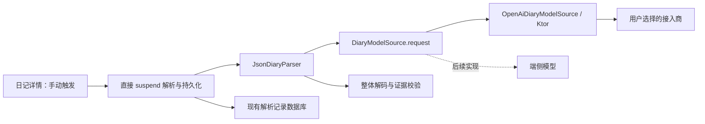

# AI 解析：精简实现与逐步讲解

当前已经实现 Ktor OpenAI-compatible adapter、模型 JSON 整体解码、证据校验、直接解析落库及候选/确认分离。后续目标是多接入商 BYOK、自定义 HTTPS 地址、每个接入商多个模型，以及单篇手动解析。

## 架构判断

现有代码已经解决了日记身份、内容哈希、模型 JSON 整体解码、证据校验、候选与当前确认分开持久化。这些行为保护用户数据，应复用。

上一版在现有模型接口之前又增加 TextGenerationRequest、TextGenerationResult、TextGenerationBackend、失败转换、桥接和额外的执行准备层。当前只有日记解析一个调用场景，这些类型的大部分行为是转发，调用者却需要学习两套相近概念。首版删除这部分计划，直接使用现有接口。



图中详情页到仓库的生产接线尚未完成；模型 adapter 和直接解析入口可被测试调用。

需要保留的接口及其价值：

- `DiaryParser`：业务调用者拿到类型化候选或失败，不需要知道接入商格式。
- `DiaryModelSource`：真正变化的位置。现在实现 HTTP 调用，测试可以替代网络，后续端侧推理也可以实现同一个接口。
- `RecordingDiaryParser`：让仓库保存原始模型回答，同时避免把原始回答塞进业务分析数据。

不再预先添加通用文本生成框架、接入商插件注册表、新的依赖注入框架、存储接口加密接口的层层转发，或为每个 HTTP 字段建立单独文件。HTTP 私有数据类型放在实现文件内，调用者不需要学习它们。

## 实施批次

### 1. Ktor 调用与现有解析器贯通（已实现）

实现一个 OpenAI-compatible adapter，支持自定义 HTTPS Base URL、模型 ID、每次请求鉴权及可选 JSON 模式。完成完整回答检查、明确的失败类型、取消传播、模型回答留存，以及 MockEngine 测试。

本批不使用真实 Key，不产生付费模型调用，不把临时测试 Key 写入配置。配置只作为不可变的内存快照。

### 2. BYOK 配置保存

增加一个具体的配置 repository，负责多接入商、各接入商模型列表、当前选择和 Key 保存。使用独立 DataStore；Android Keystore 加解密作为其内部实现，配置与加密后的 Key 一起原子更新。失败不得清空旧配置，Key 损坏必须明确反馈。

一开始只有 OpenAI-compatible 协议；DeepSeek 与自定义接入商是不同预设或配置，使用同一个 HTTP 实现。等待第二种实际协议出现再添加协议抽象。

### 3. 直接解析入口（已实现，生产配置待接线）

使用现有 repository.parse(input, recordingParser)，每次调用传入捕获好的 parser、模型配置和 Key，不安装固定配置的应用级执行器。调用方负责按钮防重和协程取消；批量解析以后按顺序循环。

extractorVersion 继续记录影响结果的模型配置、提示词及本地后处理版本，排除显示名称与 Key。每次显式重新解析执行一次请求，没有成功缓存复用或在途共享。取消和进程终止不恢复任务；失败明确提示后由用户重试。

### 4. 设置页与单篇手动解析

完成设置页面、模型选择、保存、删除与明确的连接测试，再在详情页接上解析、取消和重新解析。界面字符串使用英文及中文资源。保存配置不会自动调用模型，扫描和打开日记也不会自动调用模型。

点击解析时重新读取原文并捕获配置；异步返回不能污染其他日记。解析失败仍可查看和编辑原文，重新解析保留既有用户确认记录。

用户最后在 Android 设备上用自己的 DeepSeek Key 做真实验收，之后验证一个自定义 HTTPS 接入商。MockEngine 与 JVM 测试不能证明真实模型抽取质量。

## 第一批：读代码的顺序

### 先看已有的模型接口

`DiaryModelSource` 只有一个方法：

```kotlin
suspend fun request(text: String): DiaryModelResponse
```

`text` 是已经经过统一规范化的整篇日记，不能再次 trim 或改变空格。`suspend` 表示它可以在协程中等待，不等于自动切换到后台线程。Ktor 的请求以挂起方式等待网络；后续详情页由协程发起。

`DiaryModelResponse.Json` 表示收到了模型回答文本；`Failure` 表示明确的请求或回答失败。失败可带原始模型回答，例如被截断的内容，但不带 HTTP 错误页或 Key。

### 再看 AiHttpClient.kt

`createAiHttpClient()` 构建一个可共享的 Ktor 客户端，Android 默认用 OkHttp engine。连接最多等待 15 秒，整个请求与 socket 等待最多 120 秒。首版不自动重试，也不自动跟随重定向。

函数接受 `HttpClientEngine`：生产调用可省略这个参数，测试传入 MockEngine。这就是把外部依赖传进来，测试可以检查真实的请求处理过程，而无须启动真实接入商。

OkHttp 内部仍可能对 `503 + Retry-After: 0` 做后续请求，因此客户端将请求体标为 one-shot，禁止重发。额外的本机 HTTP 服务器测试检查真实 OkHttp 引擎在 408、503、307 响应下仅发送一次；这里的 HTTP 只用于本机测试，生产模型地址仍强制 HTTPS。

这个函数创建的客户端需要由应用持有，并在生命周期结束时关闭。每个日记请求不会新建客户端。API Key 在每次请求中附加，不会成为共享客户端的默认 header。

### 看 OpenAiDiaryModelSource.kt 的 request 方法

这份实现接收共享客户端、不可变模型配置和单独的 Key。配置可打印，Key 不放进 data class，避免自动生成的 toString 把凭据带到诊断输出。

请求的 JSON 有 model、messages、stream:false。messages 中 system 是提取指令，user 是原样日记。JSON 模式打开时才添加 response_format；关闭时不发送这个字段，以兼容只接受基本请求的接入商。

这里直接用现有 kotlinx.serialization 编码，再用 Ktor 的 TextContent 发送，不再添加 ContentNegotiation 和另一组 JSON 配置依赖。`@Serializable` 生成 JSON 编解码代码；`@SerialName` 将 Kotlin 的 responseFormat 对应到协议里的 response_format。

Base URL 是接入商给出的根地址或接口前缀。例如：

- `https://api.deepseek.com` → `/chat/completions`
- `https://gateway.example/proxy/v1/` → `/proxy/v1/chat/completions`

程序不猜测是否需要 `/v1`。只接受 HTTPS，拒绝地址里的账号密码、查询参数和片段。地址填写错时在构建调用快照时失败，尚未发送日记。

### 区分两种 JSON

接入商返回的是 HTTP 信封，常见结构是 choices → message → content。content 本身才是要交给日记解析器的 JSON 字符串。

adapter 只解包 HTTP 信封，检查回答完整性；现有 `DiaryCandidateCodec` 检查日记 JSON，`DiaryCandidateValidator` 检查证据、字段、缺失信息及组展开。各自的知识集中在原来位置。

`finish_reason=length` 即使带着看似有效的日记 JSON，也必须作为截断失败处理。模型拒绝、空回答、未知或未完成的结束原因同样不会被接受。回答里的 reasoning_content 不参与日记解析。

### 看 DiaryExtractionPrompt.kt

提示词使用现有 schemaVersion 1，没有新建第二份业务模型。要求 JSON、准确的原文引用、不编造日期或训练数据，并保留缺失值和疑问。重量继承继续交给现有本地校验器。

`VERSION` 是提示词版本，后续接线时参与 extractorVersion 的内容版本身份。它现在只是准备好的常量；生产配置尚未接线，每次显式解析都重新请求。

提示词属于发送给模型的协议内容，不属于界面文案。用户看到的错误信息仍使用 res/values 和 res/values-zh。

### 最后看测试

测试通过 `DiaryModelSource.request` 或 `JsonDiaryParser.execute` 调用生产实现，MockEngine 代替接入商。

覆盖请求地址、模型、指令、原文、鉴权、JSON 模式、常见 HTTP 失败、超时、取消、无重试、无重定向，以及有效和无效回答进入已有校验器的结果。不同接入商共用客户端时，测试还检查 Key 不会串用。

测试中的模型名与 Key 是固定的虚构值，不访问互联网。带中文、前后空格及换行的日记样本用于检查是否原样发送。

## 验收记录

以下为第一批 adapter 在本次精简前的历史验收记录；当前验证命令和范围见 [Log 扫描与验收](log-refresh-verification.md)。

- `./gradlew.bat testDebugUnitTest assembleDebug`：BUILD SUCCESSFUL。
- 270 项 JVM 测试全部通过，其中新增 18 项（17 项模型调用测试 + 1 项真实 OkHttp 引擎测试，后者检查 408、503、307 三种响应）。
- Debug APK 构建成功，产物位于 `app/build/outputs/apk/debug/app-debug.apk`。
- 针对本批修改的 `git diff --check -- app gradle docs` 通过。
- 未执行付费模型调用；未验收设备、Keystore、SAF 或界面交互。

测试 Key 和模型 ID 均为虚构值。

BYOK 配置、设置页和单篇解析按钮尚未实现。当前已提供可调用、可测试的模型 adapter 和直接解析落库入口，应用仍不能从设置页发起真实解析。

官方参考：

- [Ktor client engines](https://ktor.io/docs/client-engines.html)
- [Ktor MockEngine](https://ktor.io/docs/client-testing.html)
- [Ktor timeout](https://ktor.io/docs/client-timeout.html)
- [DeepSeek Chat Completions](https://api-docs.deepseek.com/api/create-chat-completion/)
- [Ktor 3.4.3 dependencies](https://github.com/ktorio/ktor/blob/3.4.3/gradle/libs.versions.toml)
